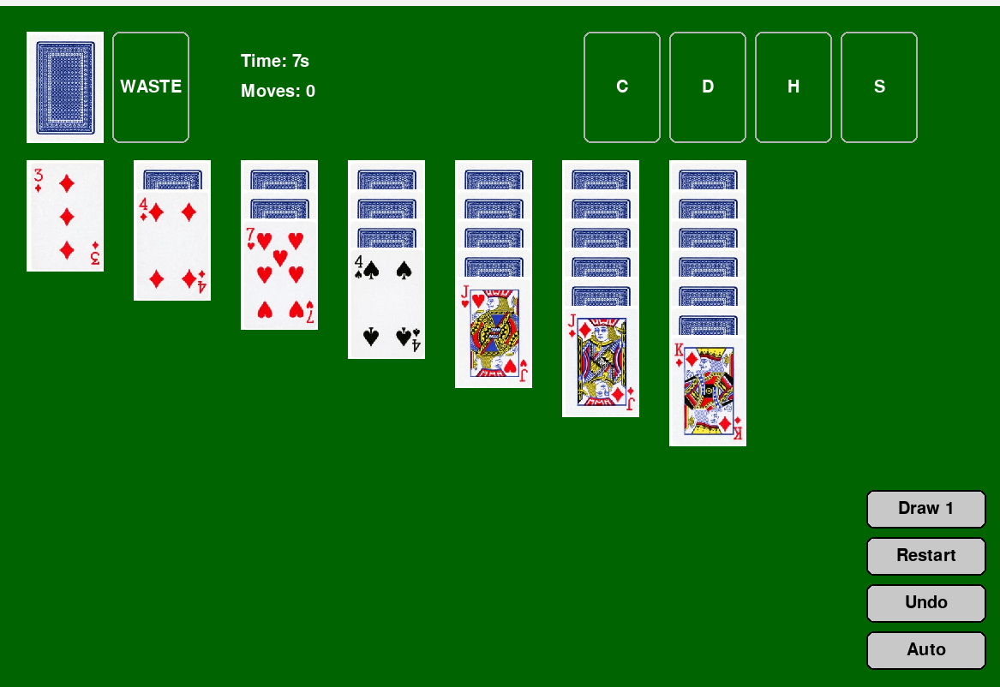

# Solitaire
A fully playable Klondike Solitaire game built using Python and Pygame.

## Features
* Drag-and-drop card movement
* Draw 1 / Draw 3 modes
* Undo functionality
* Auto-complete support
* Move counter
* Game timer
* Foundation suit validation
* Win screen with final statistics
* Custom card artwork

## Technologies Used
* Python 3
* Pygame
* Object-Oriented Programming (OOP)
* Git

## HOW TO INSTALL
Clone the repository:

```bash
git clone https://github.com/BISNU644/solitaire.git
cd solitaire
```

Install dependencies:

```bash
pip install -r requirements.txt
```

Run the game:

```bash
python Main.py
```

## Project Structure
```
Solitaire/
├── Main.py
├── Game.py
├── Card.py
├── Deck.py
├── ui.py
├── assets/
├── requirements.txt
└── README.md
```

## Screenshot



## Skills Demonstrated

* Object-oriented programming
* Event-driven programming
* State management
* Game logic implementation
* User interface development
* Debugging and testing
* Version control with Git
